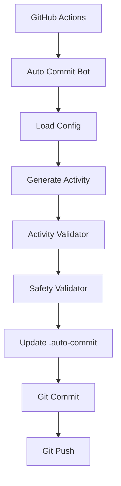

# Auto Commit Bot

A Python bot that automatically creates realistic, irregular commit activity in a GitHub repository via GitHub Actions.

> **Disclaimer**: GitHub determines contribution-graph eligibility and display. This bot cannot guarantee that any generated activity will appear on your GitHub contribution calendar. The bot is intended for testing and demonstration purposes only.

## Architecture



## How It Works

The bot runs on a schedule via GitHub Actions. On each run, it:

1. **Loads configuration** from `config.json`
2. **Checks for duplicate runs** (won't commit twice on the same day)
3. **Generates activity** using a probabilistic model
4. **Validates realism** (rejects uniform or obviously artificial patterns)
5. **Runs safety checks** (only modifies `.auto-commit/` files)
6. **Creates a real commit** (modifies `activity.json` — never empty commits)
7. **Pushes to GitHub**

### Activity Characteristics

- Many days have **0 commits** (natural gaps)
- Most active days have **1–3 commits**
- Occasional days have **4–6 commits**
- Rare high-activity days
- **Random gaps** between active periods
- **Lower weekend activity** (configurable)
- Occasional **development bursts** (2–5 day periods of higher activity)
- **Random commit times** within development hours
- **No repeating patterns**

## Installation

### Prerequisites

- Python 3.10+
- Git
- A GitHub repository you own

### Setup

1. **Clone or create your repository**:

   ```bash
   git clone https://github.com/your-username/your-repo.git
   cd your-repo
   ```

2. **Copy the bot files** into your repository:

   ```
   your-repo/
   ├── .github/workflows/auto-commit.yml
   ├── auto_commit/
   ├── .auto-commit/
   ├── config.json
   └── requirements.txt
   ```

3. **Install dependencies** (for local testing):

   ```bash
   pip install -r requirements.txt
   ```

4. **Commit and push** the bot files:

   ```bash
   git add .
   git commit -m "chore: add auto commit bot"
   git push
   ```

5. **Enable GitHub Actions** in your repository settings if not already enabled.

That's it! The bot will start running on its schedule.

## Configuration

All settings are in `config.json`:

```json
{
  "enabled": true,
  "branch": "main",
  "timezone": "Asia/Kolkata",

  "activity": {
    "weekday_probability": 0.65,
    "saturday_probability": 0.45,
    "sunday_probability": 0.35,
    "commit_distribution": {
      "0": 0.35,
      "1": 0.30,
      "2": 0.20,
      "3": 0.10,
      "4": 0.03,
      "5": 0.01,
      "6": 0.01
    }
  },

  "development_hours": {
    "start": 8,
    "end": 23,
    "periods": [
      {"name": "morning",   "start": "08:00", "end": "11:30", "weight": 0.25},
      {"name": "afternoon", "start": "13:00", "end": "17:30", "weight": 0.35},
      {"name": "evening",   "start": "19:00", "end": "23:00", "weight": 0.40}
    ]
  },

  "burst": {
    "enabled": true,
    "probability": 0.12,
    "min_days": 2,
    "max_days": 5,
    "multiplier": 1.8
  },

  "randomization": {
    "seed": null
  },

  "commit": {
    "prefix": "chore"
  }
}
```

### Key Settings

| Setting | Description | Default |
|---|---|---|
| `enabled` | Master on/off switch | `true` |
| `branch` | Target branch | `"main"` |
| `timezone` | Your timezone | `"Asia/Kolkata"` |
| `weekday_probability` | Chance of activity on a weekday | `0.65` |
| `saturday_probability` | Chance of activity on Saturday | `0.45` |
| `sunday_probability` | Chance of activity on Sunday | `0.35` |
| `burst.probability` | Chance of a development burst starting | `0.12` |
| `burst.multiplier` | Activity multiplier during bursts | `1.8` |
| `seed` | Random seed (`null` for fresh) | `null` |

## Activity Generation

### Commit Distribution

Each active day's commit count is sampled from the configured distribution:

```
0 commits → 35%
1 commit  → 30%
2 commits → 20%
3 commits → 10%
4 commits →  3%
5 commits →  1%
6 commits →  1%
```

### Weekend Behavior

Weekend activity uses lower probabilities by default:
- Weekday: 65% chance of activity
- Saturday: 45%
- Sunday: 35%

Weekends are never completely disabled.

### Development Bursts

Occasionally, a multi-day burst simulates a focused development session:

```
Monday    → 1 commit
Tuesday   → 3 commits
Wednesday → 5 commits
Thursday  → 2 commits
Friday    → 4 commits
```

Bursts are controlled by probability (default 12%) and last 2–5 days.

### Commit Times

Times are generated within configurable development periods:
- **Morning**: 08:00–11:30
- **Afternoon**: 13:00–17:30
- **Evening**: 19:00–23:00

Times use Gaussian sampling (cluster around period midpoints) and optional session clustering (multiple commits spaced 5–45 minutes apart).

## Randomization

### Fresh Schedules

```json
"seed": null
```

Each day generates a new schedule based on the date.

### Reproducible Testing

```json
"seed": 123456
```

Same seed + same config = same schedule. Useful for testing.

## Preview Mode

See what the bot would generate without making any changes:

```bash
python -m auto_commit.main --preview --days 30
```

Output includes:
- Statistics (active/inactive days, total commits, averages)
- GitHub-style contribution grid
- Realism validation score

## Dry Run Mode

Generate today's schedule and display it:

```bash
python -m auto_commit.main --dry-run
```

Shows each day's commits, times, and messages. Makes no git changes.

## Test Mode

Run internal diagnostics:

```bash
python -m auto_commit.main --test
```

Tests configuration, generator, seed reproducibility, realism validator, message generation, activity files, safety, and duplicate protection. Never pushes to GitHub.

## GitHub Actions Setup

The workflow is in `.github/workflows/auto-commit.yml`.

### Schedule

The bot uses a cron schedule (`0 */2 * * *` — every 2 hours in UTC). The bot decides internally whether to commit based on its probabilistic model.

> **Note**: GitHub Actions cron is not precise. Execution may be delayed, especially during high-demand periods.

### Manual Trigger

You can manually trigger the workflow from the GitHub Actions tab with options:
- **Force run**: Bypass duplicate check
- **Dry run**: No git changes

### Authentication

The workflow uses GitHub's built-in `GITHUB_TOKEN`. No personal access token is needed.

```yaml
permissions:
  contents: write
```

## Security

### What the Bot Does
- Only modifies files in `.auto-commit/`
- Uses `git add -- .auto-commit/file` (never `git add .`)
- Never force-pushes
- Never resets the repository
- Never deletes commits

### What the Bot Rejects
- Changes to files outside `.auto-commit/`
- `.env` files
- Credential files
- Secret files
- Oversized files
- Wrong branch

### What the Bot Never Does
- Store tokens or secrets in files
- Expose `GITHUB_TOKEN` in logs
- Use `shell=True` in subprocess calls
- Use string interpolation in git commands

## Bot-Controlled Files

```
.auto-commit/
├── activity.json    # Last activity timestamp, total counts
├── state.json       # Run state, duplicate protection
└── history.json     # Commit history log
```

These are the **only** files the bot modifies. Your project files are never touched.

## CLI Reference

```bash
# Normal execution (commit + push)
python -m auto_commit.main

# Preview schedule with statistics and grid
python -m auto_commit.main --preview --days 60

# Dry run (show schedule, no git changes)
python -m auto_commit.main --dry-run

# Run diagnostics
python -m auto_commit.main --test

# Force run (bypass duplicate check)
python -m auto_commit.main --force

# Use a specific seed
python -m auto_commit.main --preview --seed 42

# Custom config file
python -m auto_commit.main --config custom-config.json

# GitHub Actions summary
python -m auto_commit.main --summary
```

## Troubleshooting

### Bot is not running
1. Check that GitHub Actions is enabled in your repository settings
2. Verify `.github/workflows/auto-commit.yml` exists on the default branch
3. Check the Actions tab for workflow run history

### Bot creates no commits
- The bot intentionally skips many days (35% chance of 0 commits on active days)
- Check `config.json` — is `enabled` set to `true`?
- Check `--preview` to see what the bot would generate

### Duplicate run detected
- The bot only commits once per day by default
- Use `--force` to bypass this check
- Check `.auto-commit/state.json` for the last run date

### Push failed
- Verify the repository has `contents: write` permission for Actions
- Check that the branch name in `config.json` matches your default branch
- Ensure no branch protection rules block the bot

### "Not a git repository" error
- Run the bot from the repository root
- Ensure `.git/` directory exists

## Limitations

- GitHub Actions cron timing is approximate (may delay up to 15+ minutes)
- The bot uses a simplified timezone offset map — not all timezones are supported
- GitHub determines whether commits appear on the contribution graph
- The bot cannot guarantee any particular contribution-calendar result
- Only one commit per scheduled run (multiple commits within a day require multiple cron triggers)

## Project Structure

```
├── .github/workflows/auto-commit.yml   # GitHub Actions workflow
├── auto_commit/
│   ├── __init__.py                     # Package version
│   ├── main.py                         # CLI entry point
│   ├── config.py                       # Config loader + validator
│   ├── scheduler.py                    # Daily decision engine
│   ├── generator.py                    # Activity schedule generator
│   ├── activity.py                     # .auto-commit/ file manager
│   ├── git.py                          # Safe Git wrapper
│   ├── safety.py                       # Pre-commit safety checks
│   ├── realism.py                      # Realism validator (0–100)
│   └── messages.py                     # Commit message pool
├── tests/                              # Test suite
├── .auto-commit/                       # Bot-controlled data files
├── config.json                         # User configuration
├── requirements.txt                    # Dependencies
└── README.md                           # This file
```

## License

MIT License. See [LICENSE](LICENSE) for details.
